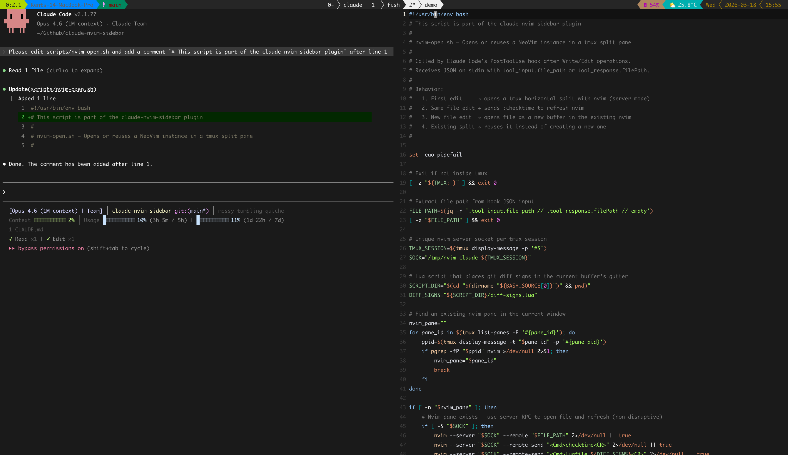

# claude-tmux-toolkit

A collection of [Claude Code](https://claude.ai/claude-code) plugins for tmux productivity.

## Plugins

### nvim-sidebar

Auto-opens NeoVim in a tmux split pane when Claude edits files — giving you a real-time sidebar view of every change.

- **Auto-open**: NeoVim opens in a new tmux split on the first file edit (when no split exists)
- **Fish sidebar support**: If you already have an idle fish shell split open, NeoVim launches inside it instead of creating a new one
- **Real-time sync**: File content refreshes instantly when Claude makes changes
- **Diff signs**: Git diff markers (`+`/`-`) in the gutter show exactly which lines were added or removed
- **Multi-file**: New files open as buffers in the same NeoVim instance (`:bn`/`:bp` to switch)
- **Smart reuse**: Detects existing NeoVim panes and updates them via server RPC — never creates duplicates
- **Non-intrusive**: Exits silently when 2+ split panes are already open, or when the existing split is neither NeoVim nor fish
- **Safehouse compatible**: Works when Claude Code is launched via [agent-safehouse](https://agent-safehouse.dev), which strips the `TMUX` environment variable

### rename-window

Renames the tmux window to the current project folder name in PascalCase on session start.

- e.g. `claude-tmux-toolkit` → `ClaudeTmuxToolkit`

## Demo



## Requirements

- [tmux](https://github.com/tmux/tmux)
- [NeoVim](https://neovim.io/) (0.7+ for `--listen`/`--server`/`--remote`) — required for `nvim-sidebar`
- [jq](https://jqlang.github.io/jq/) — required for `nvim-sidebar`
- [fish](https://fishshell.com/) — optional; enables the fish sidebar workflow (see below)
- [Claude Code](https://claude.ai/claude-code)

## Installation

### Using `/plugin marketplace add` command (recommended)

Inside Claude Code, run:

```
/plugin marketplace add kentwelcome/claude-tmux-toolkit
```

Then install individual plugins:

```bash
claude plugin install nvim-sidebar@claude-tmux-toolkit --scope user
claude plugin install rename-window@claude-tmux-toolkit --scope user
```

### Manual installation

**Step 1** — Register the marketplace in your `~/.claude/settings.json` (user scope) or `.claude/settings.json` (project scope):

```json
{
  "extraKnownMarketplaces": {
    "claude-tmux-toolkit": {
      "source": {
        "source": "github",
        "repo": "kentwelcome/claude-tmux-toolkit"
      }
    }
  }
}
```

**Step 2** — Install the plugins:

```bash
claude plugin install nvim-sidebar@claude-tmux-toolkit --scope user
claude plugin install rename-window@claude-tmux-toolkit --scope user
```

### From local path (for development)

**Step 1** — Clone the repo:

```bash
git clone https://github.com/kentwelcome/claude-tmux-toolkit.git
```

**Step 2** — Add to `~/.claude/settings.json` (user scope) or `.claude/settings.json` (project scope):

```json
{
  "extraKnownMarketplaces": {
    "claude-tmux-toolkit": {
      "source": {
        "source": "directory",
        "path": "/absolute/path/to/claude-tmux-toolkit"
      }
    }
  },
  "enabledPlugins": {
    "nvim-sidebar@claude-tmux-toolkit": true,
    "rename-window@claude-tmux-toolkit": true
  }
}
```

**Step 3** — Start Claude Code inside a tmux session and reload plugins:

```
/reload-plugins
```

**Step 4** — Trigger a file edit (Write or Edit) to verify the nvim sidebar opens.

#### Development workflow

After making changes to scripts or hooks:

1. Edit the files in the repo (e.g. `plugins/nvim-sidebar/scripts/nvim-open.sh`)
2. Run `/reload-plugins` inside Claude Code to pick up hook changes
3. Trigger a file edit to test — the hooks run the scripts directly from your local repo path, so script changes take effect immediately without reloading

## Recommended NeoVim Config

For the best experience with `nvim-sidebar`, add this to your NeoVim config so files auto-reload when changed externally:

```lua
vim.opt.autoread = true
vim.api.nvim_create_autocmd({ "FocusGained", "BufEnter", "CursorHold" }, {
    command = "silent! checktime",
})
```

Also ensure tmux has focus events enabled in your `.tmux.conf`:

```tmux
set-option -g focus-events on
```

## How nvim-sidebar Works

The plugin registers a `PostToolUse` hook on `Write` and `Edit` tool calls. On each hook invocation, the script inspects the current tmux window and picks a path:

| Window state | Action |
|---|---|
| NeoVim pane exists | Open/refresh file via server RPC (`--remote` + `:checktime`) |
| No split (single pane) | Create a new horizontal split and launch NeoVim |
| One split — idle fish shell | Launch NeoVim inside the fish pane |
| One split — other shell | Exit silently |
| 2+ splits | Exit silently |

NeoVim is started with `--listen /tmp/nvim-claude-<session>` so subsequent edits find it by socket. After every edit, `git diff` is run and `+`/`-` signs are placed in the gutter via NeoVim's sign API.

### Fish sidebar workflow

If you keep a fish shell pane open alongside Claude, `nvim-sidebar` will launch NeoVim inside it rather than creating a new split. This lets you control the layout manually — open the fish pane when you want the sidebar, close it when you don't.

### agent-safehouse compatibility

When Claude Code is launched via `safehouse`, the `TMUX` environment variable is stripped by the sandbox. The hook detects tmux by querying `tmux display-message` directly (which finds the attached session via its server socket), so it works correctly without relying on the environment variable.

## NeoVim Keybindings (for buffer navigation)

| Key | Action |
|-----|--------|
| `:bn` | Next buffer |
| `:bp` | Previous buffer |
| `:ls` | List all buffers |
| `:b <name>` | Switch to buffer by name |

## Uninstall

```bash
claude plugin uninstall nvim-sidebar@claude-tmux-toolkit
claude plugin uninstall rename-window@claude-tmux-toolkit
```

Then remove the `claude-tmux-toolkit` entry from `extraKnownMarketplaces` in your settings.json.

## License

MIT
